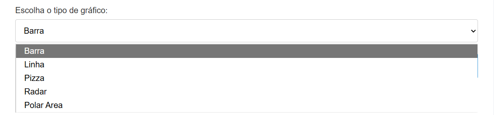
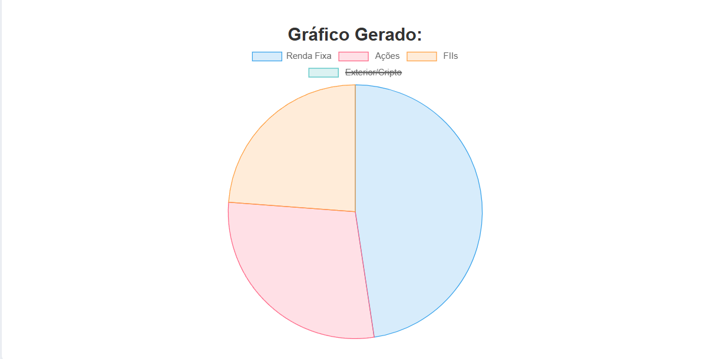

# Criador_de_Graficos
Um código para visualização de dados, onde passamos as informações escolhemos o tipo do gráfico e ele é gerado na tela

Essa é a tela de inicio, onde você coloca os nomes dos rotulos, valores e escolhe o tipo do grafico que você achar melhor.

Aqui deixei disponivel para que escolha entre 5 graficos do Chart js.

usei um exemplo de uma carteira de investimentos em um grafico de pizza pois é o mais utilizado para esse tipo de dadoss.

estará aparecendo logo abaixo o grafico escolhido com os dados passados, passando o mouse em cima mostra o valor deles.

Também pode clicar nos rotulos para ocultar 1 ou mais dados dos graficos.

também coloquei um exemplo de produtos que poderiam ser os vendidos por um vendedor especifico.

ai esta o grafico. 

# Considerações Finais
é possivel desenvolver o projeto para funcionar com uma api pegando os dados e o codigo apresentando eles. Mas o projeto foi desenvolvido para testar a criação de graficos para projetos futuros.
